<!-- ═══════════════════════════ BANNER (light / dark) ═══════════════════════════ -->
<div align="center">

<picture>
  <source media="(prefers-color-scheme: dark)" srcset="https://capsule-render.vercel.app/api?type=waving&color=0:FF69B4,100:1a1a2e&height=220&section=header&text=Welcome%20to%20my%20GitHub&fontSize=46&fontColor=ffffff&animation=fadeIn&fontAlignY=38&desc=Learning%20by%20building%20%7C%20Consistency%20over%20intensity&descAlignY=58&descSize=18">
  <source media="(prefers-color-scheme: light)" srcset="https://capsule-render.vercel.app/api?type=waving&color=0:F8BBD0,100:EF93C4&height=220&section=header&text=Welcome%20to%20my%20GitHub&fontSize=46&fontColor=4a1d33&animation=fadeIn&fontAlignY=38&desc=Learning%20by%20building%20%7C%20Consistency%20over%20intensity&descAlignY=58&descSize=18">
  
</picture>

<!-- ═══════════════════════════ TITLE ═══════════════════════════ -->
<h1 align="center">Hey there, I'm Shaurya Agrawal 👋</h1>

<!-- ═══════════════════════════ TYPING SVG ═══════════════════════════ -->
<a href="https://github.com/shaurya3571">
  
</a>

<br><br>

<!-- ═══════════════════════════ PINK BADGES ═══════════════════════════ -->
<a href="https://github.com/shaurya3571?tab=followers">
  
</a>
<a href="https://github.com/shaurya3571?tab=repositories">
  
</a>
<a href="https://github.com/shaurya3571">
  
</a>

</div>

<br>

---

<!-- ═══════════════════════════ ABOUT ME ═══════════════════════════ -->
<h2 align="center">👨‍💻 About Me</h2>

<table align="center" width="100%">
  <tr>
    <td width="65%" valign="top">

```yaml
name:      Shaurya Agrawal
role:      B.Tech CSE Student (DevSecOps)
college:   SRM Institute of Science and Technology
focus:     Full Stack Development & Frontend
learning:  DevOps, DSA, System Design
location:  India 🇮🇳
```

- 🚀 Building modern web applications and sharpening problem-solving skills
- 💻 Into Full Stack, Frontend Engineering, and DevOps
- 🌱 Currently learning the React ecosystem, backend development, and deployment workflows
- 🧠 Practicing DSA and strengthening core fundamentals
- 🎯 Looking for **Full Stack / Frontend internship** opportunities
- 💡 Philosophy: *learning by building, consistency over intensity*

  </td>
    <td width="35%" align="center" valign="middle">
      
      <br><br>
      
    </td>
  </tr>
</table>


<!-- ═══════════════════════════ GITHUB STATS ═══════════════════════════ -->
<h2 align="center">⚙️ Technology</h2>

<div align="center">

<table>
  <tr>
    <td align="center" width="50%">
      <h3><samp>Languages</samp></h3>
      
    </td>
    <td align="center" width="50%">
      <h3><samp>Frontend</samp></h3>
      
    </td>
  </tr>
  <tr>
    <td align="center" width="50%">
      <h3><samp>Backend and Database</samp></h3>
      
    </td>
    <td align="center" width="50%">
      <h3><samp>Tools and Infrastructure</samp></h3>
      
    </td>
  </tr>
</table>


</div>

---

<h2 align="center">📊 GitHub Stats</h2>

<div align="center">

<table>
  <tr>
    <td align="center" width="50%">
      <picture>
        <source media="(prefers-color-scheme: dark)" srcset="https://github-readme-stats.vercel.app/api?username=shaurya3571&show_icons=true&hide_border=true&include_all_commits=true&bg_color=0d1117&title_color=EF93C4&icon_color=FF69B4&text_color=F8BBD0&ring_color=FF69B4">
        <source media="(prefers-color-scheme: light)" srcset="https://github-readme-stats.vercel.app/api?username=shaurya3571&show_icons=true&hide_border=true&include_all_commits=true&bg_color=FFF5F9&title_color=C2185B&icon_color=FF69B4&text_color=4a1d33&ring_color=FF69B4">
        
      </picture>
    </td>
    <td align="center" width="50%">
      <picture>
        <source media="(prefers-color-scheme: dark)" srcset="https://github-readme-stats.vercel.app/api/top-langs/?username=shaurya3571&langs_count=5&hide_border=true&bg_color=0d1117&title_color=EF93C4&text_color=F8BBD0">
        <source media="(prefers-color-scheme: light)" srcset="https://github-readme-stats.vercel.app/api/top-langs/?username=shaurya3571&langs_count=5&hide_border=true&bg_color=FFF5F9&title_color=C2185B&text_color=4a1d33">
        
      </picture>
    </td>
  </tr>
</table>

<br>

<picture>
  <source media="(prefers-color-scheme: dark)" srcset="https://streak-stats.demolab.com?user=shaurya3571&theme=transparent&hide_border=true&background=00000000&ring=FF69B4&fire=EF93C4&currStreakLabel=F8BBD0&currStreakNum=FF69B4&sideLabels=F8BBD0&sideNums=FF69B4&dates=EF93C4">
  <source media="(prefers-color-scheme: light)" srcset="https://streak-stats.demolab.com?user=shaurya3571&theme=transparent&hide_border=true&background=00000000&ring=FF69B4&fire=EF93C4&currStreakLabel=C2185B&currStreakNum=FF69B4&sideLabels=C2185B&sideNums=FF69B4&dates=880E4F">
  
</picture>

<br><br>
<!-- ═══════════════════════════ CONTRIBUTION GRAPH ═══════════════════════════ -->
<h2 align="center">📈 Contribution Graph</h2>

<div align="center">

<picture>
  <source
    media="(prefers-color-scheme: dark)"
    srcset="./activity-graph.svg"
  />
  <source
    media="(prefers-color-scheme: light)"
    srcset="./activity-graph.svg"
  />
  
</picture>

</div>


</div>

---

<!-- ═══════════════════════════ CONTRIBUTION SNAKE ═══════════════════════════ -->
<h2 align="center">🐍 Contribution Snake</h2>

<div align="center">

<picture>
  <source media="(prefers-color-scheme: dark)" srcset="https://raw.githubusercontent.com/shaurya3571/shaurya3571/output/github-contribution-grid-snake-dark.svg">
  <source media="(prefers-color-scheme: light)" srcset="https://raw.githubusercontent.com/shaurya3571/shaurya3571/output/github-contribution-grid-snake.svg">
  
</picture>

</div>


---

<!-- ═══════════════════════════ CONNECT ═══════════════════════════ -->
<h2 align="center">🤝 Let's Connect</h2>

<div align="center">

<a href="https://www.linkedin.com/in/datamanlowkey/">
  
</a>
<a href="https://www.linkedin.com/in/shaurya3571">
  
</a>
<a href="https://instagram.com/shauryastack">
  
</a>
<a href="https://shauryaagrawal.xyz">
  
</a>
<a href="mailto:reachshauryaagrawal@gmail.com">
  
</a>

<br><br>


</div>

<br>

<!-- ═══════════════════════════ FOOTER ═══════════════════════════ -->
<div align="center">


</div>
